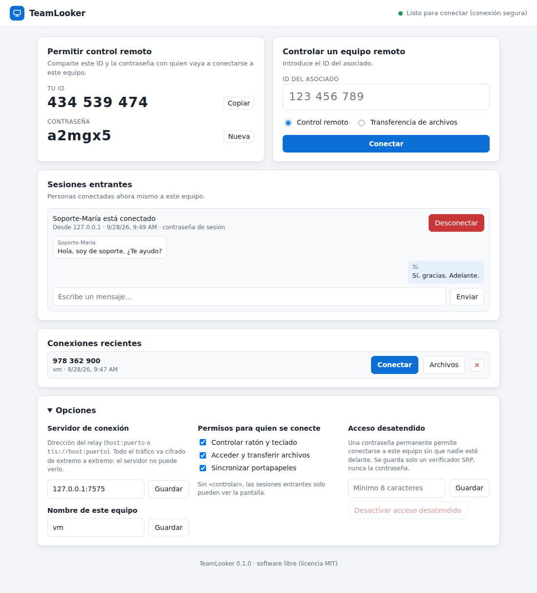
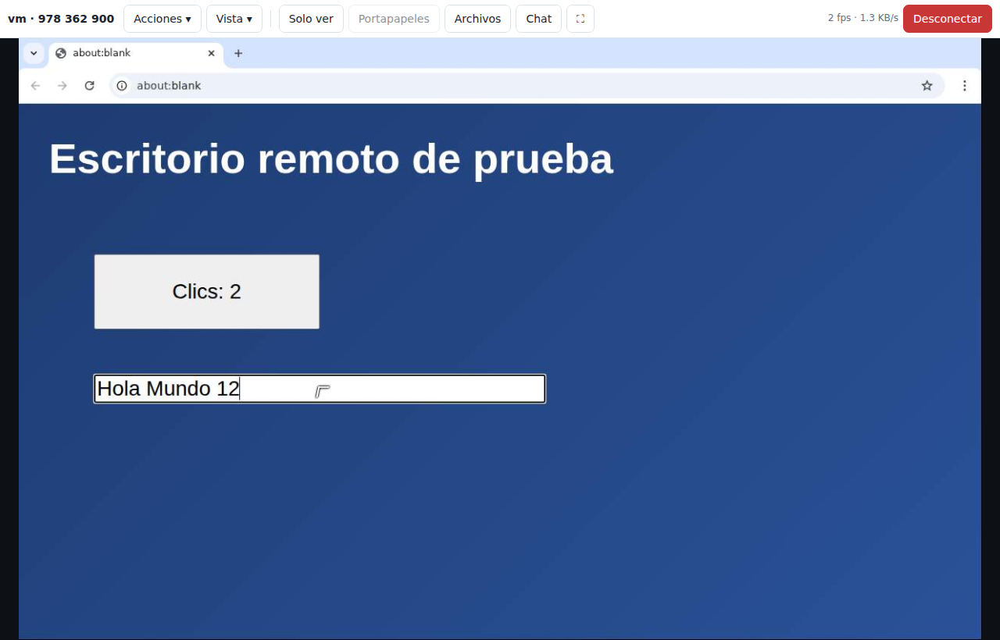
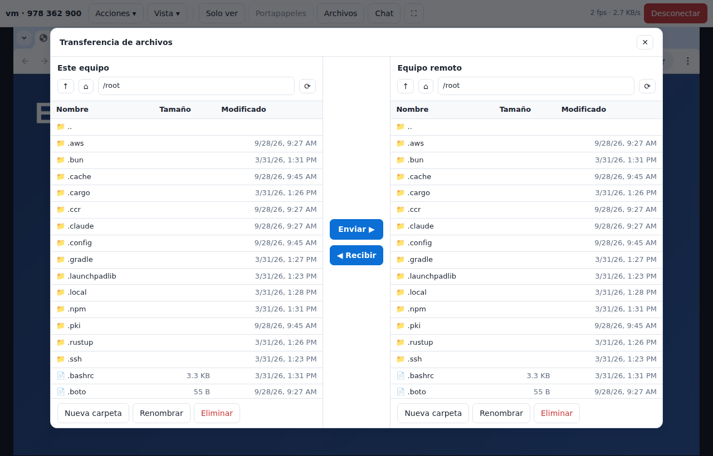

# TeamLooker

**Escritorio remoto de código abierto**, con las funciones principales de TeamViewer: conectarte a otro equipo con un **ID y una contraseña**, ver y controlar su pantalla, transferir archivos, chatear y compartir el portapapeles. Todo el tráfico va **cifrado de extremo a extremo**, y el servidor lo puedes alojar tú mismo.



| Sesión remota | Transferencia de archivos |
|---|---|
|  |  |

## Funciones

| Función | TeamLooker |
|---|---|
| ID fijo de 9 dígitos por equipo + contraseña de sesión aleatoria | ✅ |
| Acceso desatendido con contraseña permanente | ✅ (solo se guarda un verificador SRP) |
| Ver la pantalla remota en tiempo real | ✅ solo se envían las zonas que cambian (teselas JPEG) |
| Control remoto de ratón y teclado | ✅ (Ctrl+Alt+Supr, Win, Alt+Tab, Win+L desde el menú) |
| Varios monitores | ✅ selector de monitor |
| Calidad, resolución y escala de grises ajustables | ✅ |
| Cursor remoto visible | ✅ |
| Transferencia de archivos (explorador de dos paneles) | ✅ subir y bajar archivos, crear carpetas, renombrar, borrar; integridad verificada con SHA-256 |
| Modo «solo transferencia de archivos» | ✅ |
| Chat en ambos sentidos | ✅ |
| Sincronización del portapapeles (texto) | ✅ |
| Escribir el texto de tu portapapeles en el equipo remoto | ✅ |
| Modo «solo ver» | ✅ |
| Permisos del anfitrión (control, archivos, portapapeles) | ✅ se aplican en el anfitrión, no en el visor |
| Ver quién está conectado y expulsarlo | ✅ |
| Conexiones recientes | ✅ |
| Funciona detrás de NAT/firewall (sin abrir puertos) | ✅ vía servidor relay |
| Cifrado de extremo a extremo | ✅ SRP-6a + AES-256-GCM |
| Protección contra fuerza bruta | ✅ bloqueo exponencial en el anfitrión + límite por IP en el relay |
| Servidor propio (self-hosted), con TLS opcional | ✅ `teamlooker relay`, imagen Docker |
| Anfitrión sin interfaz (servidores, servicio del sistema) | ✅ `teamlooker host` |
| Windows, macOS y Linux (X11) | ✅ (Python) |

Todavía **no** incluye: audio remoto, videollamada, impresión remota, transferencia de carpetas completas, grabación de sesiones, Wayland nativo, pantalla segura de Windows (UAC) ni apps móviles. Ver [hoja de ruta](#hoja-de-ruta).

## Cómo funciona

```
  Equipo A (visor)              Servidor relay              Equipo B (anfitrión)
┌──────────────────┐          ┌────────────────┐          ┌──────────────────────┐
│ navegador (UI)   │          │ empareja IDs y │          │ app TeamLooker       │
│ app TeamLooker ──┼─saliente─►  reenvía bytes ◄─saliente─┼─ captura + entrada   │
└──────────────────┘          └────────────────┘          └──────────────────────┘
         ◄══════ canal cifrado de extremo a extremo (SRP-6a + AES-256-GCM) ══════►
```

* Cada equipo tiene un par de claves Ed25519; su **ID** se deriva de la clave pública, así que es estable y nadie más puede registrarlo.
* Ambos equipos solo hacen conexiones **salientes** al relay, por eso funciona detrás de routers y firewalls.
* La **contraseña nunca viaja** por la red: se usa SRP-6a, un protocolo estándar de autenticación por contraseña (PAKE), para acordar una clave de sesión. El relay no puede leer nada ni hacer ataques de diccionario offline.
* La interfaz es una página web local (`127.0.0.1`, protegida con un token aleatorio) que abre la aplicación en tu navegador; no necesita Electron ni Qt.

Detalles del protocolo y del modelo de seguridad en [docs/ARQUITECTURA.md](docs/ARQUITECTURA.md).

## Instalación

Requiere **Python 3.10 o superior**.

```bash
git clone https://github.com/rromero04-web/teamlooker-opensource.git
cd teamlooker-opensource
python -m pip install .
```

Requisitos según el sistema:

* **Linux**: sesión X11 (en Wayland, inicia sesión con «Xorg»). Para el portapapeles instala `xclip` o `xsel`.
* **macOS**: la primera vez, concede a tu terminal/Python los permisos de *Grabación de pantalla* y *Accesibilidad* (Ajustes del Sistema → Privacidad y seguridad).
* **Windows**: no necesita nada más. Para controlar ventanas elevadas (administrador), ejecuta TeamLooker como administrador.

## Uso rápido

### 1. Pon en marcha un servidor relay

En cualquier máquina accesible por ambos equipos (un VPS, o un PC de tu red local):

```bash
teamlooker relay --port 7575
# o con Docker:
docker build -t teamlooker-relay . && docker run -d -p 7575:7575 teamlooker-relay
```

El relay solo necesita el puerto TCP 7575 abierto. No guarda nada en disco.

### 2. Abre TeamLooker en los dos equipos

```bash
teamlooker app --relay mi-servidor.ejemplo.com:7575
```

Se abrirá la ventana principal en tu navegador, con **tu ID** y una **contraseña**. El servidor queda guardado en la configuración (también se puede cambiar en *Opciones*).

### 3. Conéctate

En el equipo que va a controlar, escribe el **ID del asociado**, pulsa **Conectar** e introduce la contraseña que aparece en el otro equipo. Elige «Transferencia de archivos» si solo quieres mover archivos.

Dentro de la sesión:

* **Acciones**: Ctrl+Alt+Supr, tecla Windows, Alt+Tab, bloquear, escribir tu portapapeles, refrescar.
* **Vista**: ajustar a la ventana, calidad (velocidad/equilibrada/calidad), resolución transmitida, escala de grises, cursor remoto.
* **Solo ver**, **Portapapeles**, **Archivos**, **Chat**, **pantalla completa** (captura también Alt+Tab y Esc en navegadores que lo permiten) y **Desconectar**.

## Otros comandos

```bash
teamlooker info                         # tu ID, servidor y permisos
teamlooker set-password                 # contraseña permanente (acceso desatendido)
teamlooker set-password --clear         # desactivarla
teamlooker host                         # compartir este equipo sin interfaz (muestra ID y contraseña)
teamlooker host --no-session-password   # aceptar solo la contraseña permanente
teamlooker app --viewer-only            # solo controlar otros equipos; este no será accesible
teamlooker screenshot 123456789 -o captura.png   # captura de un equipo remoto
```

Para dejar un equipo Linux siempre accesible hay un servicio de ejemplo en [`contrib/teamlooker-host.service`](contrib/teamlooker-host.service), y otro para el relay en [`contrib/teamlooker-relay.service`](contrib/teamlooker-relay.service).

### Relay con TLS

El canal ya va cifrado de extremo a extremo, pero puedes cifrar también la conexión con el relay (oculta los IDs a observadores de red):

```bash
teamlooker relay --certfile fullchain.pem --keyfile privkey.pem
teamlooker app --relay tls://mi-servidor.ejemplo.com:7575
```

Con un certificado autofirmado, indica a los clientes la CA con la variable `SSL_CERT_FILE=/ruta/ca.pem`.

### Configuración

Se guarda en `~/.config/teamlooker/config.json` (Linux), `~/Library/Application Support/TeamLooker/` (macOS) o `%APPDATA%\TeamLooker\` (Windows). La variable `TEAMLOOKER_HOME` cambia la carpeta y `TEAMLOOKER_RELAY` el servidor por defecto. Los archivos recibidos en el visor se guardan en la carpeta elegida en el panel local (por defecto `~/Downloads/TeamLooker`).

## Desarrollo

```bash
python -m pip install -e ".[dev]"
pytest -q
```

Las pruebas levantan un relay, un anfitrión (con pantalla y entrada simuladas) y un visor reales, y cubren: autenticación, bloqueo por fuerza bruta, que el relay solo vea texto cifrado, streaming con control de flujo, entrada remota, multi-monitor, chat, portapapeles, explorador y transferencia de archivos, permisos y la interfaz local.

Estructura:

```
teamlooker/
  relay.py         servidor relay/broker
  relay_client.py  registro del anfitrión y conexión del visor
  srp.py           SRP-6a (RFC 5054)
  secure.py        handshake y canal AES-256-GCM
  host.py          servicio anfitrión y sesiones entrantes
  viewer.py        sesión del visor
  screen.py        captura (mss) y codificación por teselas
  inputctl.py      inyección de ratón/teclado (pynput)
  files.py         explorador y transferencias
  clipboard.py     portapapeles (pyperclip)
  config.py        configuración persistente
  ui/              interfaz local (aiohttp + HTML/JS)
  cli.py           línea de comandos
```

## Hoja de ruta

* Transferencia de carpetas y arrastrar y soltar sobre la pantalla remota.
* Captura en Wayland (xdg-desktop-portal + PipeWire).
* Códec de vídeo (H.264/VP8) para mejor rendimiento en conexiones lentas.
* Conexión directa P2P (UDP hole punching) antes de recurrir al relay.
* Audio remoto, grabación de sesiones, libreta de direcciones con grupos.
* Servicio de Windows para controlar la pantalla de inicio de sesión y UAC.

## Aviso legal

TeamLooker es un proyecto independiente, no está afiliado ni respaldado por TeamViewer. Úsalo solo en equipos sobre los que tengas autorización.

Licencia [MIT](LICENSE).
